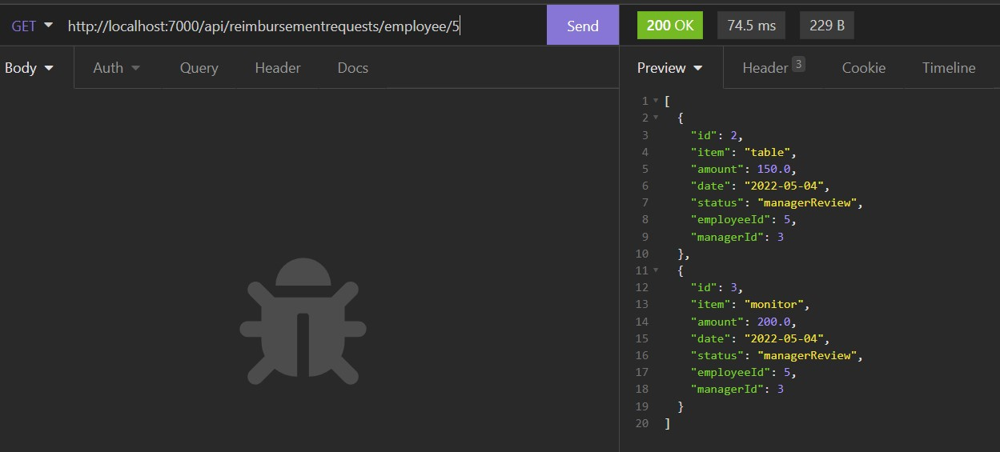

# expense-reimbursement-system

## Table of Contents

[Description](#description) | [Features](#features) | [Technology](#technology) | [Links](#links) | [Screenshot(s)](#screenshots) | [Questions](#questions) | [License](#license)

## Description
This application is an expense reimbursement system that manages the process of reimbursing employees for expenses. Employees can submit reimbursement requests for approval and view all of their requests. Requests can be reassigned to another employee to be approved. Managers can view all requests assigned to them. If a manager approves a request then an email will be sent acknowledging the approval that includes details of the request.

## Features
- Persisted data through a Google Cloud Platform MySQL database
- Built application images and ran them in containers using Docker
- Utilized Docker Compose to define and run the multi-container application
- Logging, Javadocs and tests

## Technology
Key technologies and dependencies used in this project:
- Java
- JUnit
- Spring Boot
- Spring Data 
- Spring MVC 
- Docker
- Log4J
- Lombok
- Maven
- Git
- Hibernate
- GCP Cloud SQL
- MySQL

## Links
- [GitHub repository](https://github.com/darylnauman/expense-reimbursement-system)

## Screenshot(s)
#### Reimbursements by Manager Id

## Questions
Please contact me if you have any questions.

## License
This product is under the MIT License.
